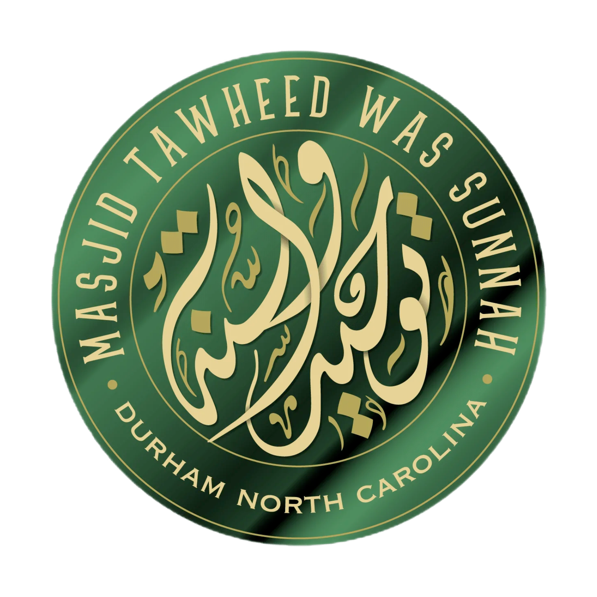

<h1 align="center">Markaz Tawheed was-Sunnah</h1>

By the permission of Allah, since 2002 <a href="https://www.mtws.org/">Markaz Tawheed Wa Sunnah (MTWS)</a> has established the <b>Da'wah</b> of Islam in our City of Durham, North Carolina, and the surrounding community.

Our <strong>Masjid</strong> is located in the <b>Research Triangle Park (RTP)</b> which is the largest research park in the United States. It is named for the three hub cities of Raleigh, Durham, and Chapel Hill, or more properly, for the three major research universities in those three cities North Carolina State University, Duke University, and the University of North Carolina at Chapel Hill, respectively.

This strategic location provides us with a platform to launch Dawah programs to local universities, secondary schools, news media, radio stations and churches, while providing a place for Friday prayer and daily prayers for the many Muslims who work in the Research Triangle Park.

<!-- Links will have a globe emoji -->
<h2>Links 🌐 </h2>
<!-- mtws.org - Our Main Website -->
<!-- mtws.one - Information Website -->
<!-- mtws.one/dawah - Dawah Website -->
<!-- mtws.posthaven.com - Blog -->
<!-- MTWS Youtube Channel - https://www.youtube.com/@mtwsnc9534 -->
<a href="https://www.mtws.org/">Markaz Tawheed Wa Sunnah (MTWS)</a>
 
<a href="https://www.mtws.one/">MTWS Information Website</a>
 
<a href="https://www.mtws.one/dawah">MTWS Dawah Website</a>
 
<a href="https://www.mtws.posthaven.com/">MTWS Blog</a>
<h3>Social Media Links</h3>
<a href="https://www.youtube.com/@mtwsnc9534">MTWS YouTube Channel</a>
 <a href="https://twitter.com/MTWSNC">MTWS Twitter</a>